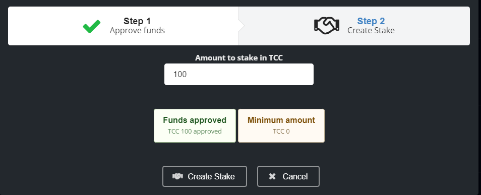

# 💰 Amity Wallet



Use `/register` in our Discord to register your Wallet.\
Amity DeFi will send you your **Private Key; make sure to save it!**\
****You'll need this Key for your [metamask-wallet.md](metamask-wallet.md "mention").\
****\
****After that is done, you should change your network to `Avalanche` with `/network`

Press `TAB` or `Space` on your Keyboard after writing `/network` or select `network` from the popup/dropdown. Type in **`avalanche`** into the little box that you created from selecting a `network` or by pressing `TAB` or `Space`.\
\
**It should look like this:**

.png>)

Now, you should be good to go to add `TCC` and `tcPOT` to your Wallet.\
You can easily do that with `/addtoken`\
``\
``For `TCC`: \
Do `/addtoken` followed by `SPACE` or `TAB` or select contract and type in `TCC` into the `Contract` Field.\
\
For `tcPOT`:\
For `tcPOT`, do `/addtoken` followed by `SPACE` or `TAB` or select contract and type in `tcPOT` into the `Contract` Field.\
\
**It should look like this:**\
**** \
\
In the rare cases that the Shortcodes for TCC and tcPOT are not working, use the [token-contracts.md](../about-us/token-contracts.md "mention") instead of TCC or tcPOT.\
\
\
For all the other great functions of Amity, watch the video above.
